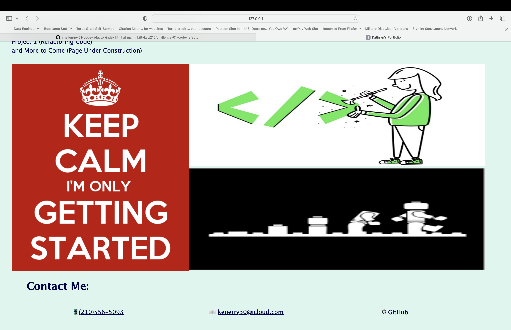
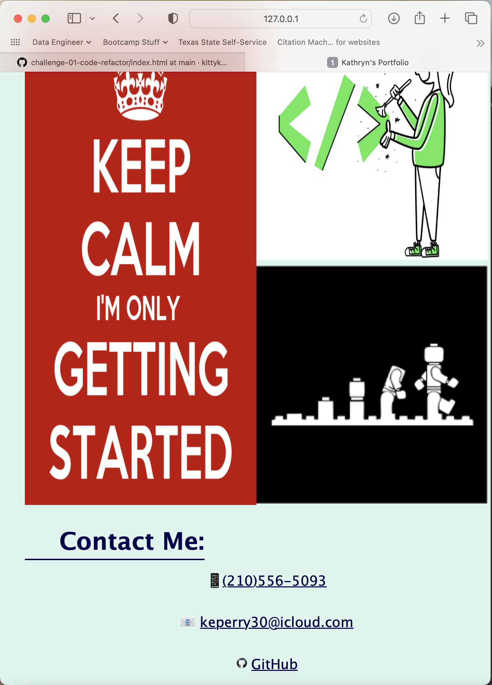
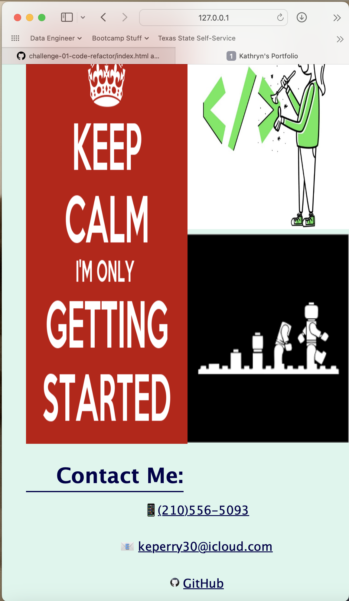

# challenge-02-portfolio

## Description

As a budding full stack developer I know it is important to have a single location where I can showcase my work. This allows me, as well as others, not only see the work I have done but to see my progression in this craft.

The purpose of the this project was to start a portfolio of my work that I can continue to add to.

Having this portfolio page allows easy access to my work. It also keeps my work in a single, easily viewable location without having to go to various webpages. Additionally, it provides my contact information as well as my updated resume.

This project taught me that it is important to have an idea of what you want your page to look like and have it drawn out - a wireframe. Just like anything else in life, a plan is important! If you have an idea drawn out it is much easier to code. I also learned that I have a propensity to work on a section at a time, doing both HTML and CSS coding. As a visual person it is hard for me to code all of the HTML first and then add the styling.

## Installation

To view my project click the link below:

https://kittykatt210.github.io/challenge-02-portfolio

## Usage

This project is intended to be used as a landing page for my portfolio of full stack web development work. 

The following images show the web application's appearance for viewing on a full size monitor:

The following images show the web application's appearance for viewing on a tablet sized screen:

The following images show the web application's appearance for viewing on a smaller mobile device screen:

## Credits

The following resource was used to learn how to make a hyperlink that opens in a new tab:

https://www.freecodecamp.org/news/how-to-use-html-to-open-link-in-new-tab/

GitHub icon retrieved from:

https://icons8.com/icons/set/github